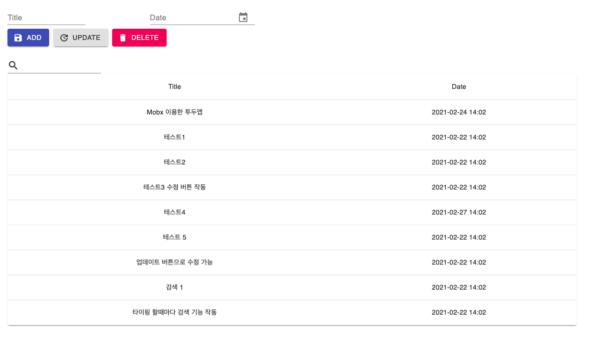

# Mobx를 활용한 간단한 TodoList 앱

React (class component) 와 mobx (decorator 사용) 를 이용해서 Todolist 제작

## 1. 기능

- 제목 설정과 date picker를 이용한 날짜 설정 기능
- 마우스로 수정하고자하는 todo 클릭 후 update 버튼을 이용한 수정 기능
- Delete 버튼을 통한 삭제 기능
- 타이핑 할때 마다 검색 기능 작동

## 2. Source

- namoosori ([Youtube](https://www.youtube.com/channel/UCtaUzBujIBjtrkqACmkM44g))
